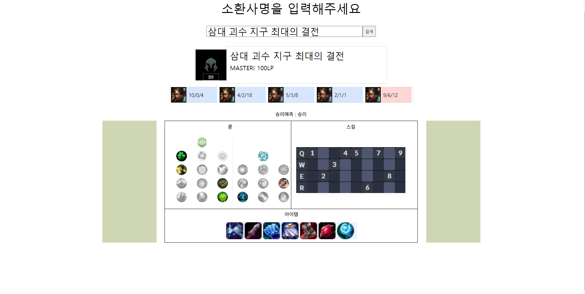

# LoL 승패예측 웹

소환사명을 검색하면 Riot API로 소환사 정보·최근 매치를 조회하고, 학습된 모델(`my_model.h5`)로 승패를 예측하는 웹 페이지입니다.



## 구성
- `backend/main.py` — FastAPI 서버 (Riot API 프록시 + 승패 예측 `/matchPredict/`)
- `backend/predict.py` — xpm, gpm, dpm, dpd 4개 지표로 모델 학습 후 `my_model.h5` 저장
- `front/` — `main.html`, `info.js`

## 실행
```bash
pip install -r requirements.txt
export RIOT_API_KEY=발급받은_API_KEY
cd backend && uvicorn main:app --reload
```
서버 실행 후 `front/main.html`을 브라우저로 열면 됩니다 (`http://127.0.0.1:8000` 호출).
